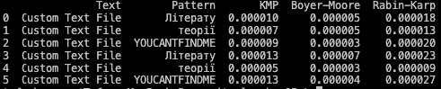

# Conclusions

## Comparison between KMP and Boyer-Moore:

Pattern "Літерату": KMP and Boyer-Moore algorithms show similar performance, but KMP appears to be slightly faster.
Pattern "теорії": Similarly, there is a similar performance between KMP and Boyer-Moore, with KMP being slightly faster.

## Comparison between KMP and Rabin-Karp:

Pattern "Літерату": KMP outperforms Rabin-Karp in terms of speed.
Pattern "теорії": KMP also outperforms Rabin-Karp when searching for the "теорії" pattern.

## Comparison between Boyer-Moore and Rabin-Karp:

Pattern "Літерату": Boyer-Moore is faster than Rabin-Karp when searching for the "Літерату" pattern.
Pattern "теорії": Boyer-Moore is faster than Rabin-Karp when searching for the "теорії" pattern.

### In summary:

The KMP algorithm is generally the fastest option for searching for the given patterns in the specified texts.
The Boyer-Moore algorithm performs similarly to KMP and is faster than Rabin-Karp.
The Rabin-Karp algorithm appears to be slower in these specific scenarios.
