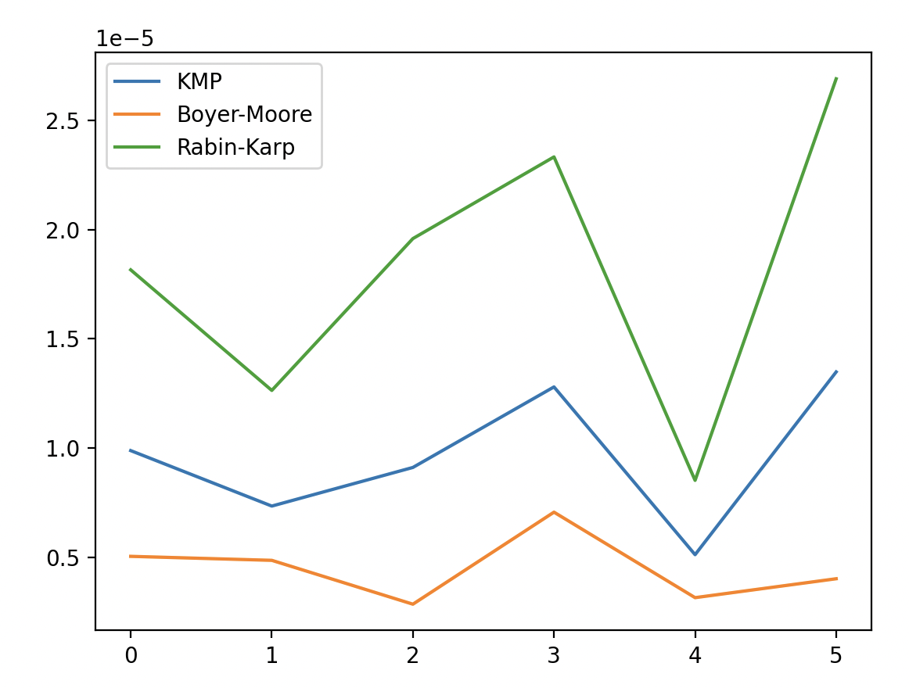

# Conclusions

## KMP Algorithm

This algorithm generally shows consistent performance regardless of the patterns. The times when the pattern is found and not found are quite close to each other. This indicates that the KMP algorithm exhibits stable performance.

## Boyer-Moore Algorithm:

This algorithm provides quicker results than the others, especially when the pattern is not found in the text. This suggests that the Boyer-Moore algorithm is extremely effective when the pattern is not present in the text. On the other hand, it is also the fastest among the algorithms when the pattern is found.

## Rabin-Karp Algorithm

Rabin-Karp is the slowest in most of the tested cases. This is more noticeable especially when the pattern is not found. This situation indicates that the Rabin-Karp algorithm is suitable for specific situations (like when multiple patterns are checked simultaneously).

## Summary

Based on this information, if you have a use case where the searched pattern is often not found in the text, the Boyer-Moore algorithm might be the best option. If overall performance is important and the distribution of finding or not finding the pattern in the text is balanced, then the KMP algorithm could be preferred. It's important to remember that Rabin-Karp generally performs slower than the other two algorithms, except in specific circumstances.
